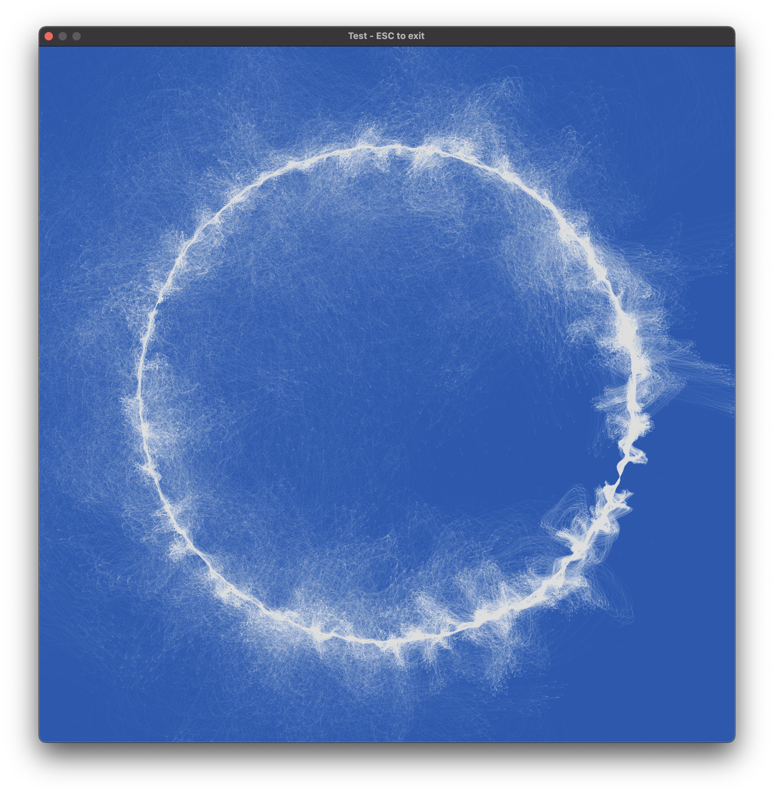
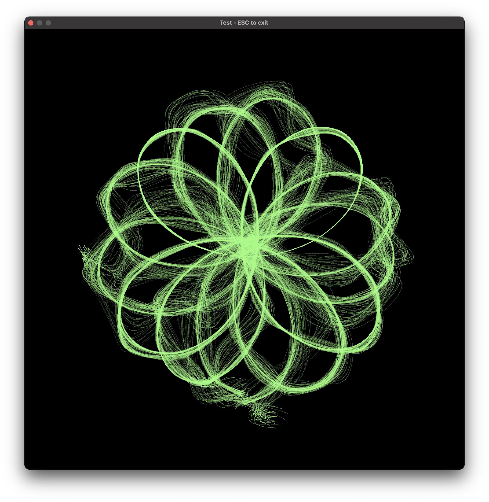
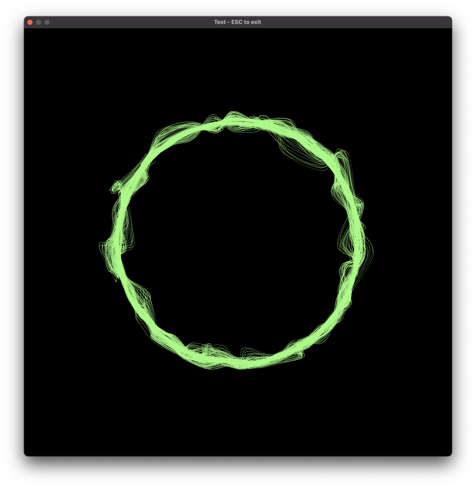
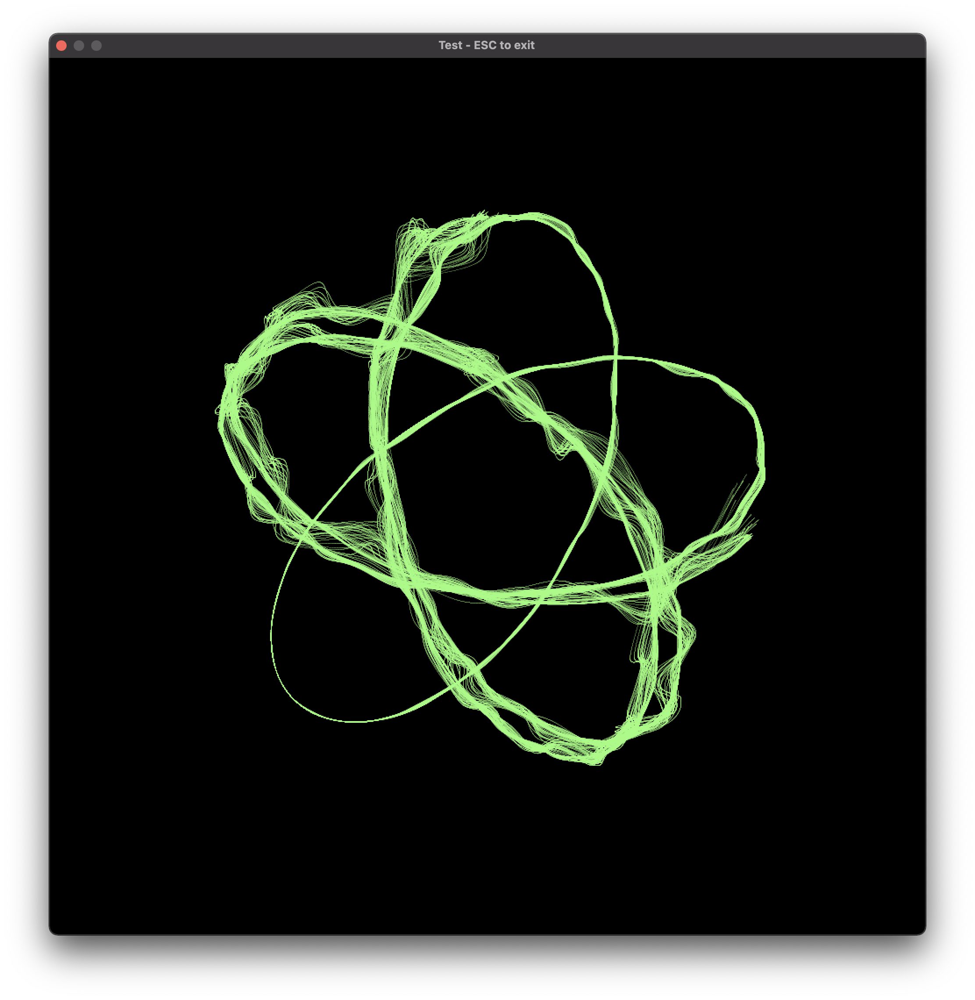

# Generative splines in Rust (work in progress)

## Installation

* `git clone https://github.com/olesho/generative_splines`
* `cargo run`

## Inspiration 
Inspired by: https://github.com/inconvergent/sand-spline

## Some results:

